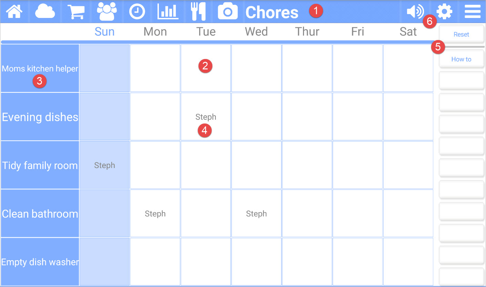

title: Chores App
comments: false

---

The **Chores** app for Kitchen Essentials allows you help with the household chores. You can create new chores and assign people to them. A person is assigned to a chore for a specific day of the week. Once the person has finished doing their chore they can press on their name to mark themselves finished. 

## Picture callouts 

1. The title bar

	The title bar shows the name of the current app and provides access to the other apps. The icons on the left side are the other apps, while the icons on the right control the volume, open up the settings for the current app, and show the other options for the current app.
	
2. The day of a chore. You can hold down a day to change the person assigned to it.

3. A chore. Hold down on the chore to change it.

4. Someone who has been assigned to a chore. Press on them to mark it as finished or not finished.

5. Use the settings (gear) icon to manage who is in the chores system.

## Button bar definitions

| Button | Description |
| --------- | ------------------------------- |
| Reset          | Clear all completed chores. |
| How to         | Navigates to this help page. |
