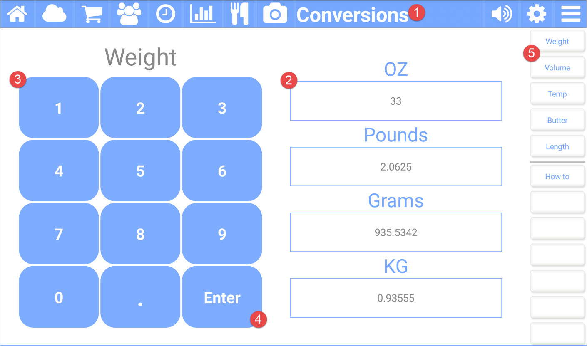

title: Conversions App
comments: false

---

The **Conversions** app for Kitchen Essentials provides an easy way to convert between common measurements. 

## Picture callouts 

1. The title bar

    The title bar shows the name of the current app and provides access to the other apps. The icons on the left side are the other apps, while the icons on the right control the volume, open up the settings for the current app, and show the other options for the current app.
	
2. The conversion types for the current category (category is changed by using area #5).

    By pressing on one of these, you can type in the amount (using area #3) for conversion.

3. The input pad to provide a value for the selected (area #2) type.

4. Press on **Enter** to have the value converted.

5. The button bar for the current app.

## Button bar definitions

| Button | Description |
| --------- | ------------------------------- |
| Weight    | Shows the conversions for weight. |
| Volume    | Shows the conversions for volume. |
| Temp      | Converts between Celsius and Fahrenheit. |
| Butter    | Shows common sizes for butter. |
| Length    | Shows common lengths for conversion. |
| How to    | Navigates to this help page. |
