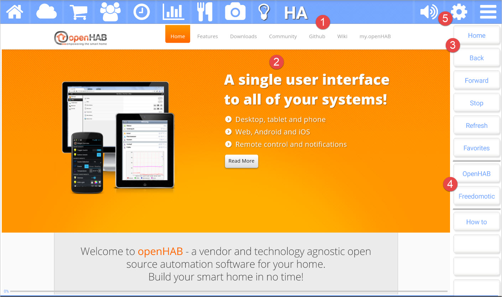

title: Home Automation (HA)
comments: false

---

The **Home Automation (HA))** app for Kitchen Essentials allows you to connect up to your local home automation web server. This allows you to manage all of your home automation needs without a dedicated app or client. 

>**Note:** Your home automation solution must support generic web browser access.

## Picture callouts 

1. The title bar

	The title bar shows the name of the current app and provides access to the other apps. The icons on the left side are the other apps, while the icons on the right control the volume, open up the settings for the current app, and show the other options for the current app.
	
2. The web browser showing the selected website.

3. The button bar for the current app.

4. The websites that came with the app or your favorite home automation sites.

5. Use the settings (gear) icon to add your local home automation management website.

## Button bar definitions

| Button | Description |
| --------- | ------------------------------- |
| Home           | Navigates back to the previously page. |
| Back           | Navigates back to the previous page. |
| Forward        | Navigates forward if you had previously navigated backwards. |
| Stop           | Stops loading the current page. |
| Refresh        | Refreshes the current page. |
| Favorites      | Manages your favorite home automation sites. Add the current page to your favorites if you like. |
| VARIOUS        | Your favorite home automation websites are listed here. |
| How to         | Navigates to this help page. |
