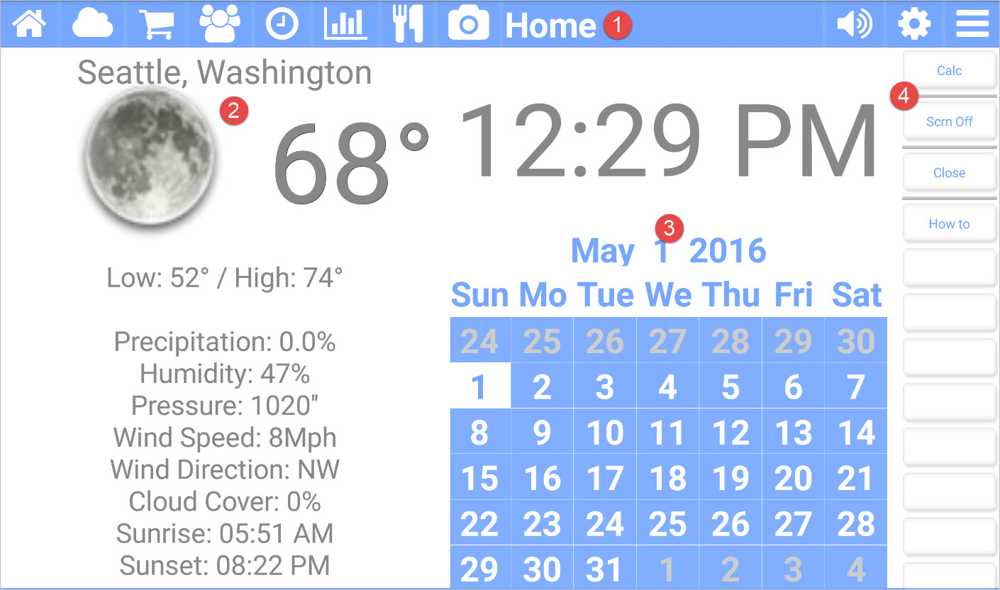

title: Home App
comments: false

---

The **Home** app for Kitchen Essentials provides you a quick snapshot of the time and weather. It is the default screen shown when you start.

## Picture callouts

1. The title bar
	The title bar shows the name of the current app and provides access to the other apps. The icons on the left side are the other apps, while the icons on the right control the volume, open up the settings for the current app, and show the other options for the current app.
2. This displays the current default city (configured in the Weather app) and the weather details.
3. The current date and a snapshot of the calendar
4. The button bar for the current app.

## Button bar definitions

| Button | Description |
| --------- | ------------------------------- |
| Calc      | Runs the built-in Android Calculator. |
| Scrn Off  | Turns off the screen. |
| Show Info | Describes information. |
| Show Logs | Displays the current log file. |
| Close     | Shuts down Kitchen Essentials. |
| How to    | Navigates to this help page. |