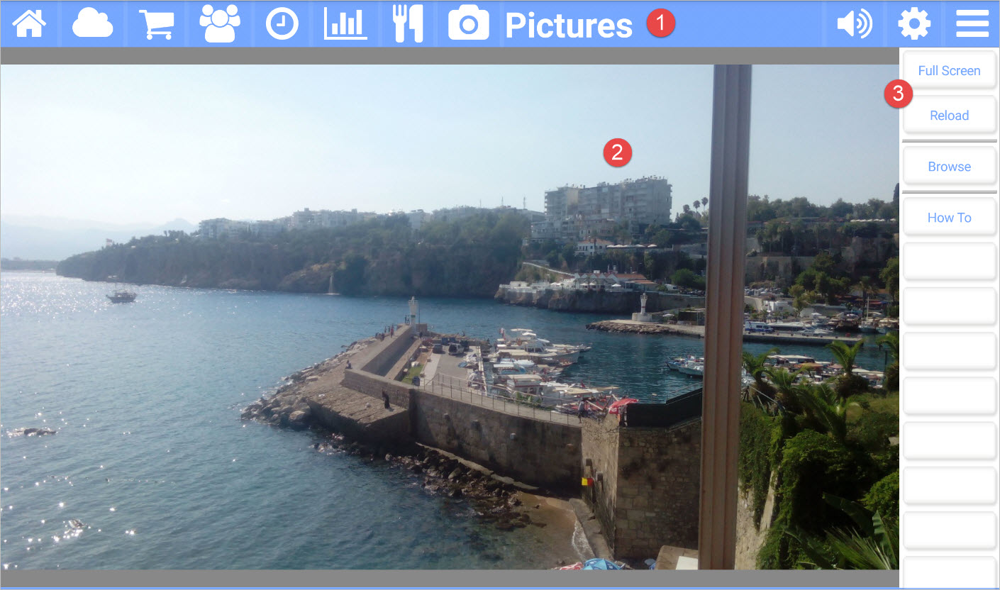

title: Pictures App
comments: false

---

The **Pictures** app for Kitchen Essentials allows you to turn the tablet into a digital picture frame. You can even use these pictures as your screensaver! 

## Picture callouts 

1. The title bar

	The title bar shows the name of the current app and provides access to the other apps. The icons on the left side are the other apps, while the icons on the right control the volume, open up the settings for the current app, and show the other options for the current app.
	
2. The current picture.

    Click the picture to get a carosel of your picture library.

5. The button bar for the current app.

## Button bar definitions

| Button | Description |
| ---------   | ------------------------------- |
| Full Screen | Starts a slide show of your pictures using the whole screen. |
| Reload      | Scans for new pictures. |
| Browse      | Shows the carosel of pictures from your gallery. |
| How to      | Navigates to this help page. |
