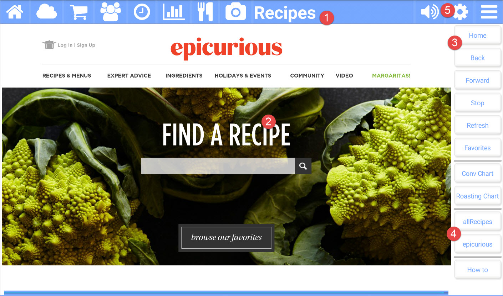

title: Recipes App
comments: false

---

The **Recipes** app for Kitchen Essentials allows you to search for that perfect recipe! You can store your favorite recipes too! When you get Kitchen Essentials, allrecipes.com and epicurious.com are provided as recipe websites. You can easily add your own! 

## Picture callouts 

1. The title bar

	The title bar shows the name of the current app and provides access to the other apps. The icons on the left side are the other apps, while the icons on the right control the volume, open up the settings for the current app, and show the other options for the current app.
	
2. The web browser showing the selected website.

5. The button bar for the current app.

4. The websites that came with the app or your own.

5. Use the settings (gear) icon to manage your websites.

## Button bar definitions

| Button | Description |
| --------- | ------------------------------- |
| Home           | Navigates back to the previously selected recipe website. |
| Back           | Navigates back to the previous page. |
| Forward        | Navigates forward if you had previously navigated backwards. |
| Stop           | Stops loading the current page. |
| Refresh        | Refreshes the current page. |
| Favorites      | Manages your favorite recipes. Add the current page to your favorites if you like. |
| Conv Chart     | Shows a conversion chart. |
| Roasting Chart | Shows a roasting chat. |
| VARIOUS        | Your favorite recipe websites are listed here. |
| How to         | Navigates to this help page. |
