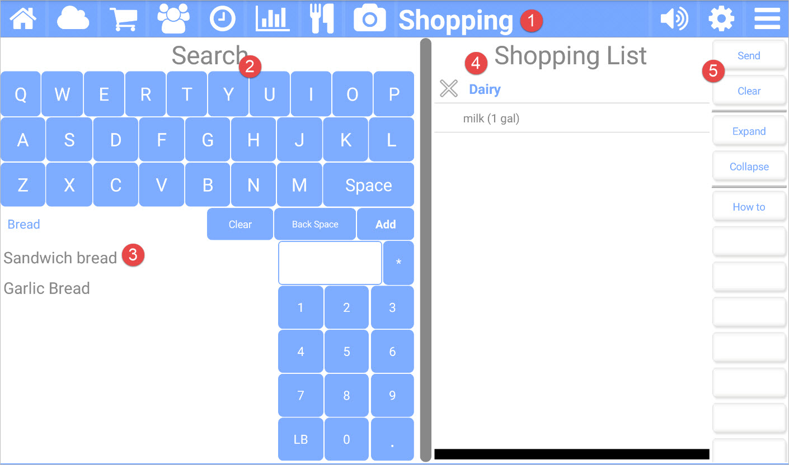

title: Shopping App
comments: false

---

The **Shopping** app for Kitchen Essentials provides an easy way to keep track of the needed groceries. You can even email the list to yourself or another person. 

## Picture callouts 

1. The title bar

    The title bar shows the name of the current app and provides access to the other apps. The icons on the left side are the other apps, while the icons on the right control the volume, open up the settings for the current app, and show the other options for the current app.
	
2. The search area

    Press the letters to start searching for a list of known groceries. If the item you are looking for is not available, you can add it by pressing the **Add** button.
	
	Known groceries are listed in area #3.

3. The known items when searching.

    Press on one of these grocery items to add it to the shopping list.

4. The shopping list of groceries to get.

    Groceries are grouped by category. The category can be expanded to show all the items in it.
	
	Delete a grocery item by pressing and holding the item.  
	**Tip:** Don't press and hold the category.

5. The button bar for the current app.

## Button bar definitions

| Button   | Description |
| -------- | ------------------------------- |
| Send     | Sends an email to one or more addresses. |
| Clear    | Clears the shopping list. |
| Expand   | Expands all categories so that you can see all grocery items. |
| Collapse | Collapses all of the categories to give you more room to see. |
| How to   | Navigates to this help page. |
