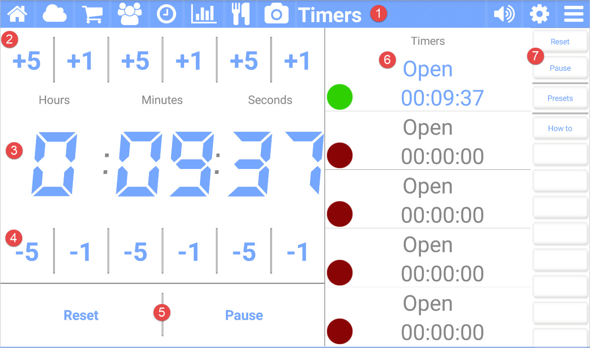

title: Timers App
comments: false

---

With the **Timers** app for Kitchen Essentials you can time five things. Use a timer for things other than cooking. If the kids are misbehaving, put them in a timeout and have **Timers** count down. Is there a 15-minute reading assignment after school? Track it here! Does the steak need to rest for 5-minutes? Set up a timer!

## Picture callouts 

1. The title bar

	The title bar shows the name of the current app and provides access to the other apps. The icons on the left side are the other apps, while the icons on the right control the volume, open up the settings for the current app, and show the other options for the current app.
	
2. Add hours, minutes, or seconds to the selected timer.

3. The current time left or set for the selected timer.

4. Subtract hours, minutes, or seconds to the selected timer.

5. Reset or start the selected timer.

6. The list of timers.

    - Click on each timer each timer to select it.
	- The selected is colored blue (or the color of the current theme).
	- A green dot on a timer indicates it is running.
	- A blinking green dot on a timer indicates it has expired. Press it to stop.
	- An orange dot on a timer indicates it is paused.

7. The button bar for the current app.

**Tip:** You can change timer presets and sounds using the settings (gear) icon.

## Button bar definitions

| Button | Description |
| ---------   | ------------------------------- |
| Reset       | Resets the selected timer. |
| Start/Pause | Starts or pauses the selected timer. |
| Presets     | Manages preset timers for things you commonly time. |
| How to      | Navigates to this help page. |
