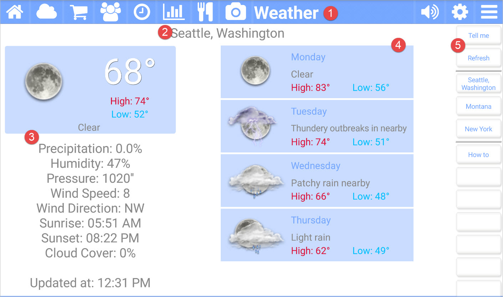

title: Weather App
comments: false

---

The **Weather** app for Kitchen Essentials gives you the daily and weekly forecast. 

## Picture callouts 

1. The title bar

    The title bar shows the name of the current app and provides access to the other apps. The icons on the left side are the other apps, while the icons on the right control the volume, open up the settings for the current app, and show the other options for the current app.
	
2. The selected location for the weather.

    Click on one of the locations in the *Button bar* to change the selected location.

3. The current weather for the day.

4. The next 4-day forecast of the weather.

5. The button bar for the weather app.

## Button bar definitions

| Button    | Description |
| --------- | ------------------------------- |
| Tell me   | Speaks the weather forecast to you. |
| Refresh   | Gets the latest weather forecast of the selected location. |
| VARIOUS   | The next items are the locations you have set. Click on the settings (gear) icon to change these. |
| How to    | Navigates to this help page. |
